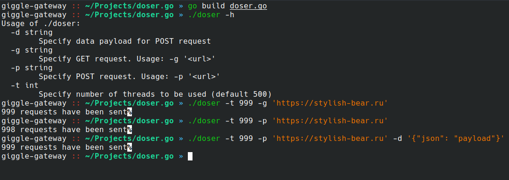

# doser.go

[](https://github.com/stylish-bear/doser.go/actions/workflows/go.yml)

DoS tool for HTTP requests (inspired by hulk but has more functionalities) written in Go:



## How to use?
1. Compile it
   ```bash
   go build doser.go
   ```
2. Use it (For example: 999 threads sends GET requests). P.S: Do not really attack my website pls
   ```bash
   ./doser -t 999 -g 'https://stylish-bear.ru'
   ```


## Usage
```txt
Usage of ./doser: [-h] [-g G] [-p P] [-d D] [-ah AH] [-t T]

optional arguments:

  -h, --help  show this help message and exit
  
  -g        Specify GET request. Usage: -g '< url >'
  
  -p        Specify POST request. Usage: -p '< url >'
  
  -d        Specify data payload for POST request
  
  -t        Specify number of threads to be used
```

## TODO:
- [X] Rewrite to Golang :)
